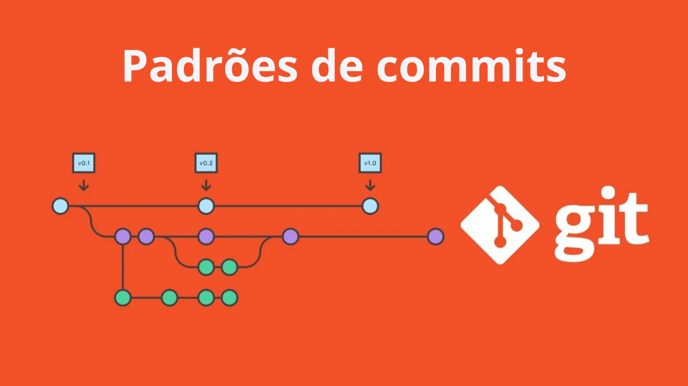

<h1 align="center">
  
</h1>

[**Conventional Commits**](https://www.conventionalcommits.org/en/v1.0.0/#specification) (Commits Convencionais) são uma convenção para nomear e estruturar mensagens de commit em repositórios de controle de versão. Essa convenção visa padronizar a forma como as mensagens de commit são escritas, tornando-as mais legíveis, compreensíveis e fáceis de seguir.

A ideia por trás dos Conventional Commits é fornecer uma estrutura consistente para as mensagens de commit, permitindo uma melhor rastreabilidade das alterações feitas ao longo do tempo. Além disso, essa abordagem facilita a geração automática de notas de lançamento, geração de changelogs e outros processos automatizados relacionados à gestão de versões.

A estrutura básica de uma mensagem de commit convencional segue o seguinte padrão:

```shell
<tipo>[escopo opcional]: <descrição>
```

O `<tipo>` representa a natureza do commit e pode ser um dos seguintes valores:

- `feat` (Feature - Funcionalidade):

Esse tipo de commit é usado quando uma nova funcionalidade é adicionada ao projeto. Pode ser a implementação de um novo recurso, a adição de uma nova página, a criação de uma nova API, entre outros. Os commits desse tipo geralmente introduzem algo novo e visível no software. É comum que um commit feat seja associado a um incremento na versão do software, como um lançamento de uma nova versão principal (por exemplo, de 1.0 para 2.0) ou uma versão secundária (por exemplo, de 1.0 para 1.1).

- `fix` (Bug Fix - Correção):

Esse tipo de commit é utilizado quando um bug é corrigido no código. Pode envolver a solução de um erro, uma falha de segurança ou qualquer outro problema que esteja afetando o funcionamento adequado do software. Os commits desse tipo geralmente corrigem problemas existentes. Normalmente, um commit fix está associado a uma versão de correção, como uma versão de manutenção (por exemplo, de 1.0 para 1.0.1) ou uma versão de patch (por exemplo, de 1.0 para 1.0.2).

- `docs` (Documentation - Documentação):

Esse tipo de commit é usado para alterações na documentação do projeto. Pode incluir atualizações ou melhorias na documentação técnica, adição de exemplos, correções ortográficas, atualização de comentários no código, entre outros. Os commits desse tipo não alteram diretamente o funcionamento do software, mas melhoram a compreensão do projeto. Normalmente, os commits docs não estão diretamente associados a um incremento na versão do software, mas podem fazer parte de uma versão geral do projeto.

- `style` (Code Style - Estilo de código):

Esse tipo de commit envolve alterações relacionadas à formatação ou estilo de código. Pode incluir ajustes de espaçamento, indentação, quebra de linhas, nomeação de variáveis, remoção de código morto, entre outros. Os commits desse tipo não alteram a funcionalidade do software, mas melhoram a legibilidade e a consistência do código. Geralmente, esses commits não estão diretamente associados a um incremento na versão do software, mas podem ser incluídos em uma versão devido a outras alterações no projeto.

- `refactor` (Code Refactoring - Refatoração de código):

Esse tipo de commit é utilizado quando o código é reestruturado ou modificado internamente sem alterar seu comportamento externo. Pode envolver otimizações de desempenho, melhoria da arquitetura, reorganização de arquivos, simplificação de lógica, entre outros. Os commits desse tipo visam melhorar a qualidade do código sem adicionar novas funcionalidades ou corrigir bugs específicos. Normalmente, os commits refactor não estão diretamente associados a um incremento na versão do software, mas podem ser parte de uma versão quando houver mudanças significativas na estrutura interna do projeto.

- `test` (Tests - Testes):

Esse tipo de commit é usado para adicionar, modificar ou corrigir testes no projeto. Pode envolver a criação de novos casos de teste, a expansão da cobertura de testes existente, a correção de testes falhando, entre outros. Os commits desse tipo têm como objetivo garantir a qualidade e a estabilidade do software por meio de testes automatizados. Normalmente, os commits test não estão diretamente associados a um incremento na versão do software, mas podem ser parte de uma versão quando houver melhorias significativas nos testes ou garantia de qualidade.

- `chore` (Chores - Tarefas diversas):

Esse tipo de commit é utilizado para atualizações relacionadas a tarefas de construção, configuração ou ferramentas. Pode incluir alterações em scripts de construção, atualizações de dependências, configurações de ambiente, entre outros. Os commits desse tipo não afetam diretamente o código do software, mas estão relacionados a atividades de suporte ou manutenção. Normalmente, os commits chore não estão diretamente associados a um incremento na versão do software, mas podem ser parte de uma versão para indicar melhorias ou atualizações de infraestrutura.

## **O relacionamento de Major, Minor e patch nessas definições são:**

- `feat` (Feature - Funcionalidade):

  - **Major**: Um incremento na versão principal (Major) é comumente associado a commits feat. Quando uma nova funcionalidade significativa é adicionada, pode ser apropriado aumentar o número da versão principal.
  - **Minor**: Dependendo da política de versionamento do projeto, um incremento na versão menor (Minor) também pode estar relacionado a commits feat. Se a funcionalidade adicionada for considerada uma mudança incremental importante, pode justificar um incremento na versão menor.
  - **Patch**: Normalmente, commits feat não estão diretamente associados a incrementos na versão de patch (Patch). Os incrementos de patch geralmente são reservados para correções de bugs.

- `fix` (Bug Fix - Correção):

  - **Major**: Um incremento na versão principal (Major) geralmente não está associado a commits fix. Correções de bugs raramente justificam um aumento na versão principal.
  - **Minor**: Dependendo da política de versionamento do projeto, um incremento na versão menor (Minor) pode estar relacionado a commits fix. Se a correção de um bug for considerada uma alteração significativa no comportamento do software, pode justificar um incremento na versão menor.
  - **Patch**: Commits fix são frequentemente associados a incrementos na versão de patch (Patch). Correções de bugs são consideradas mudanças incrementais menores que podem justificar um aumento na versão de patch.

- `docs` (Documentation - Documentação):

  - **Major**: Commits docs geralmente não estão diretamente associados a incrementos na versão principal (Major). Alterações na documentação são consideradas mudanças auxiliares e não têm um impacto direto no funcionamento do software.
  - **Minor**: Incrementos na versão menor (Minor) não são tipicamente associados a commits docs. Alterações na documentação são consideradas mudanças menores e, geralmente, não justificam um aumento na versão menor.
  - **Patch**: Commits docs raramente estão relacionados a incrementos na versão de patch (Patch). As alterações na documentação não afetam diretamente o funcionamento do software e, portanto, não justificam um aumento na versão de patch.

- `style` (Code Style - Estilo de código):

  - **Major**: Commits style geralmente não estão diretamente associados a incrementos na versão principal (Major). Mudanças de estilo de código são consideradas alterações auxiliares e não têm um impacto direto no comportamento do software.
  - **Minor**: Incrementos na versão menor (Minor) não estão normalmente associados a commits style. Mudanças de estilo de código são consideradas mudanças menores e, geralmente, não justificam um aumento na versão menor.
  - **Patch**: Commits style raramente estão relacionados a incrementos na versão de patch (Patch). As alterações de estilo de código não afetam diretamente o funcionamento do software e, portanto, não justificam um aumento na versão de patch.

- `refactor` (Code Refactoring - Refatoração de código):

  - **Major**: Commits refactor geralmente não estão diretamente associados a incrementos na versão principal (Major). Refatorações são consideradas mudanças internas e não têm um impacto direto no comportamento do software.
  - **Minor**: Incrementos na versão menor (Minor) não estão normalmente associados a commits refactor. Refatorações são consideradas mudanças internas e não justificam um aumento na versão menor.
  - **Patch**: Commits refactor raramente estão relacionados a incrementos na versão de patch (Patch). As refatorações não afetam diretamente o funcionamento do software e, portanto, não justificam um aumento na versão de patch.

- `test` (Tests - Testes):

  - **Major**: Commits test geralmente não estão diretamente associados a incrementos na versão principal (Major). Adições ou modificações de testes não têm um impacto direto no comportamento do software.
  - **Minor**: Incrementos na versão menor (Minor) não estão normalmente associados a commits test. Adições ou modificações de testes são consideradas mudanças menores e não justificam um aumento na versão menor.
  - **Patch**: Commits test raramente estão relacionados a incrementos na versão de patch (Patch). As alterações nos testes não afetam diretamente o funcionamento do software e, portanto, não justificam um aumento na versão de patch.

- `chore` (Chores - Tarefas diversas):

  - **Major**: Commits chore geralmente não estão diretamente associados a incrementos na versão principal (Major). Tarefas diversas, como atualizações de configuração ou dependências, são consideradas mudanças auxiliares e não têm um impacto direto no comportamento do software.
  - **Minor**: Incrementos na versão menor (Minor) não estão normalmente associados a commits chore. Tarefas diversas são consideradas mudanças menores e, geralmente, não justificam um aumento na versão menor.
  - **Patch**: Commits chore raramente estão relacionados a incrementos na versão de patch (Patch). As tarefas diversas não afetam diretamente o funcionamento do software e, portanto, não justificam um aumento na versão de patch.

## **Algumas recomendações para Conventional Commits são:**

- **Adotar uma convenção de nomenclatura:** Siga uma convenção específica para nomear seus commits, como a especificada pelo padrão Conventional Commits. Isso ajuda a manter uma estrutura consistente e facilita a leitura e compreensão dos commits.

- **Dividir as alterações em commits pequenos e atômicos:** Cada commit deve conter uma alteração lógica e independente. Isso torna mais fácil rastrear e revisar as alterações no histórico do projeto, além de facilitar a aplicação e reversão de mudanças específicas.

- **Utilizar palavras-chave para identificar o tipo de commit:** Use palavras-chave específicas, como feat, fix, docs, style, refactor, test, chore, para identificar o tipo de alteração realizada no commit. Isso ajuda a entender rapidamente o propósito do commit.

- **Fornecer descrições claras e concisas:** Forneça uma descrição clara e concisa do que foi alterado no commit. Use uma linguagem descritiva que explique o que a alteração faz e por que ela foi feita. Evite descrições vagas ou genéricas.

- **Separar o cabeçalho do corpo com uma linha em branco:** Separe o cabeçalho do commit, que consiste no tipo e descrição, do corpo do commit com uma linha em branco. No corpo, você pode fornecer detalhes adicionais, como contexto, motivação ou informações relevantes sobre a alteração.

- **Usar a escrita no imperativo:** Escreva as mensagens do commit no tempo verbal imperativo, como "Adiciona recurso" ou "Corrige bug". Isso ajuda a manter uma linguagem consistente e direcionada às ações realizadas no commit.

- **Referenciar problemas ou tarefas:** Se o commit estiver relacionado a um problema, bug ou tarefa específica, é recomendável fazer referência a eles na descrição do commit. Isso facilita a rastreabilidade e a comunicação com outros membros da equipe.

- **Evitar commits com alterações não relacionadas:** Evite agrupar alterações não relacionadas em um único commit. Cada commit deve ter um escopo bem definido e tratar de uma alteração específica.

- **Revisar e refatorar commits antes de finalizá-los:** Antes de finalizar um commit, revise cuidadosamente as alterações feitas e a mensagem do commit. Certifique-se de que as alterações estão corretas, a mensagem é clara e todas as diretrizes estão sendo seguidas.

- **Integrar os commits de forma regular:** Faça commits de forma regular à medida que você avança no desenvolvimento, em vez de agrupar várias alterações em um único commit. Isso facilita a revisão, a colaboração e a integração contínua do código.

## **Complementos de Commits**

- **Escopo:**

O escopo é usado para indicar o contexto ou o componente específico do projeto em que a alteração foi feita. Por exemplo, um escopo pode ser usado para indicar um módulo, uma página, uma funcionalidade específica ou qualquer outra unidade de organização do código.

Exemplo: **`feat(auth): Adiciona autenticação por token JWT`**

- **Breaking Changes (Mudanças Incompatíveis):**

Esse complemento é usado para indicar mudanças no código que podem causar quebra de compatibilidade com versões anteriores. Isso é especialmente útil em alterações de versão principal (Major) para fornecer informações claras sobre as mudanças que podem afetar a integração ou o uso do software.

Exemplo: **`feat(api): Adiciona novo endpoint de API /users\n\nBREAKING CHANGE: Altera o formato de retorno do endpoint /users`**

- **Referência cruzada:**

  As referências cruzadas são usadas para vincular o commit a problemas, tarefas ou solicitações de alteração (pull requests) relacionadas. Isso facilita a rastreabilidade e a colaboração entre commits e as ferramentas de gerenciamento de projetos.

  Exemplo: **`fix(bug): Corrige problema de autenticação\n\nRef #123`**

- **Notas de Rodapé:**

As notas de rodapé permitem fornecer informações adicionais ou metadados sobre o commit. Isso pode incluir informações sobre o autor, a data, a versão associada ou qualquer outra informação relevante para o commit.

Exemplo: **`chore(config): Atualiza arquivo de configuração\n\nCo-authored-by: John Doe <johndoe@example.com>\nRelease-Version: 1.2.0`**

É importante destacar que os complementos são opcionais e sua adoção pode variar dependendo das necessidades e das diretrizes do projeto. Os complementos podem ajudar a fornecer informações mais detalhadas e contextuais nos commits, melhorando a rastreabilidade e a compreensão das alterações realizadas no código-fonte.
